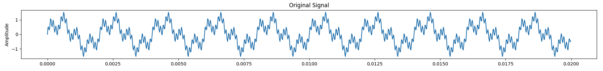
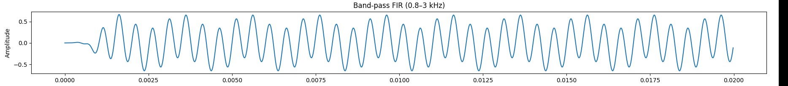

# Band Pass FIR

---

## Golden Output




The input signal is sampled at $f_s = 50000$ for a duration of $0.02$ seconds. The input can be generated by

```python
for n in range(num_samples):
        sample = (
            0.8 * math.sin(2 * math.pi * 500 * n / fs)
            + 0.5 * math.sin(2 * math.pi * 2000 * n / fs)
            + 0.3 * math.sin(2 * math.pi * 10000 * n / fs)
        )
        x_int.append(int(round(sample * IN_SCALE)))
```

---

## Comparing outputs

The output of the dut is saved as `dut_output.json` in the outputs folder. To compare the output of the generated design against the golden output, run the command

```bash
python3 scripts/compare_outputs.py
```