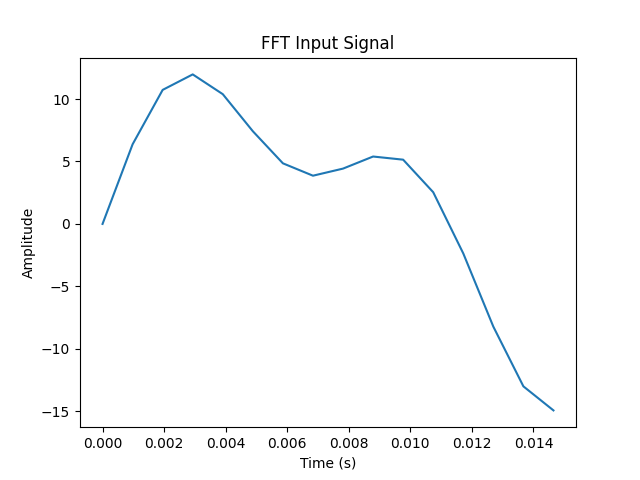
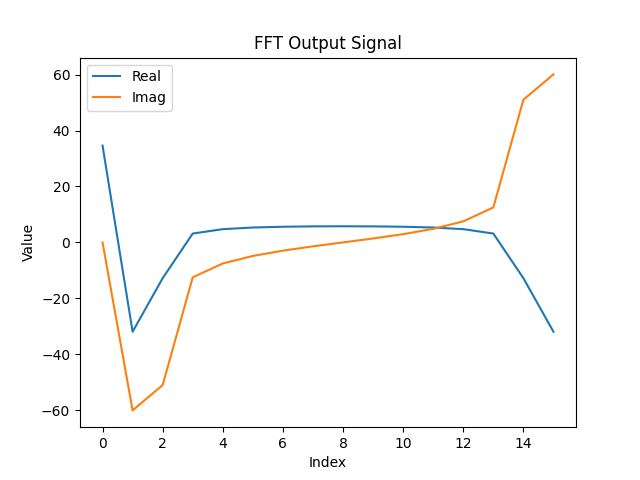

# 16 Point Iterative FFT

---

## Golden Output




The input signal is sampled at $f_s = 1024$ and 16 samples are taken. The input can be generated by

```python
stimulus = 10 * np.sin(2 * np.pi * 50 * t) + 5 * np.sin(2 * np.pi * 120 * t)
```

---

## Comparing outputs

The output of the dut is saved as `dut_output.json` in the outputs folder. To compare the output of the generated design against the golden output, run the command

```bash
python3 scripts/compare_outputs.py
```