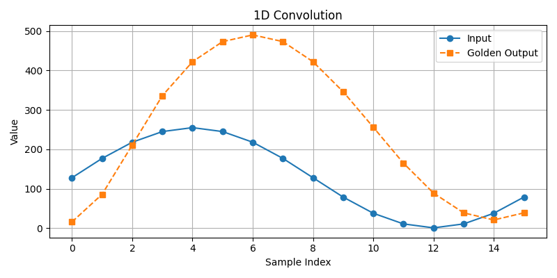

# 1D Convolution

---

## Golden output



The input signal contains $16$ discrete values. A kernel of length $5$ is applied on the signal with zero-padding. The kernel used is $\begin{bmatrix} 2 & 8 & 12 & 8 & 2 \end{bmatrix}$.

## Comparing outputs

The output of the dut is saved as `dut_output.json` in the outputs folder. To compare the output of the generated design against the golden output, run the command

```bash
python3 scripts/compare_outputs.py
```