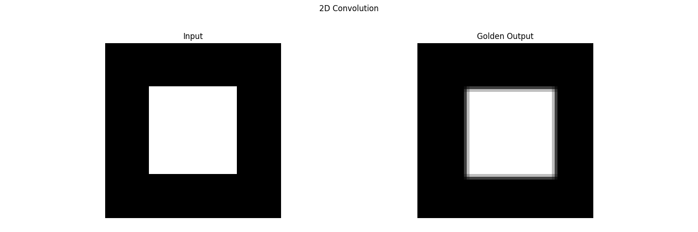

# 2D Convolution

---

## Golden output



The input image is of dimensions `64x64`. A `3x3` kernel is applied on the image with zero-padding. The kernel used is $\begin{bmatrix} 1 & 2 & 1 \\ 2 & 4 & 2 \\ 1& 2& 1\end{bmatrix}$.

## Comparing outputs

The output of the dut is saved as `dut_output.json` in the outputs folder. To compare the output of the generated design against the golden output, run the command

```bash
python3 scripts/compare_outputs.py
```